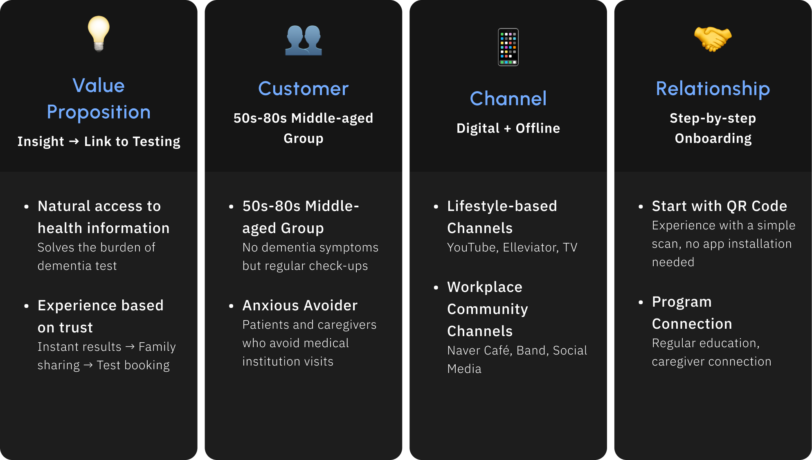
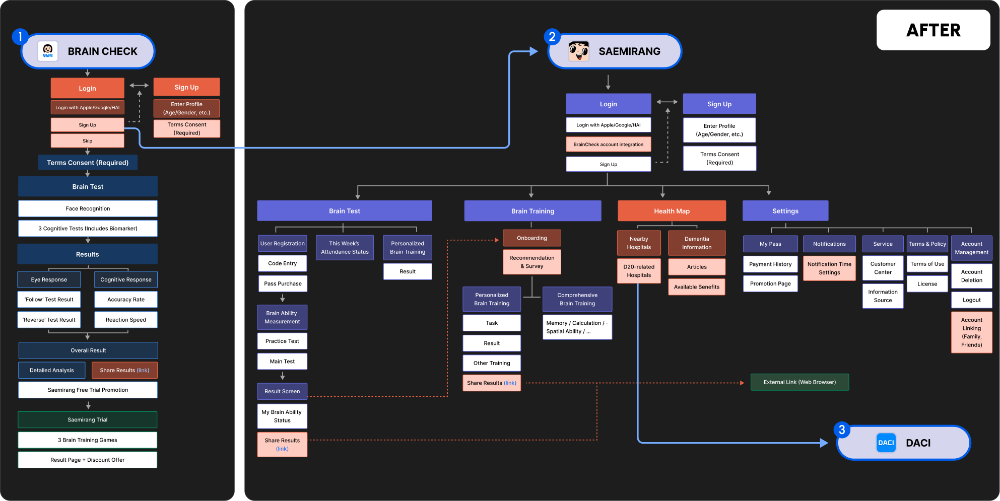
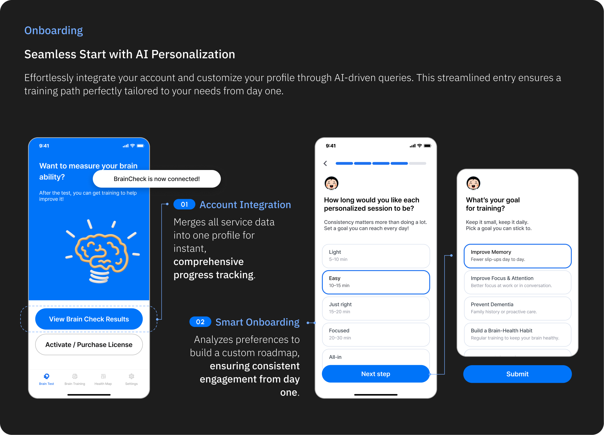
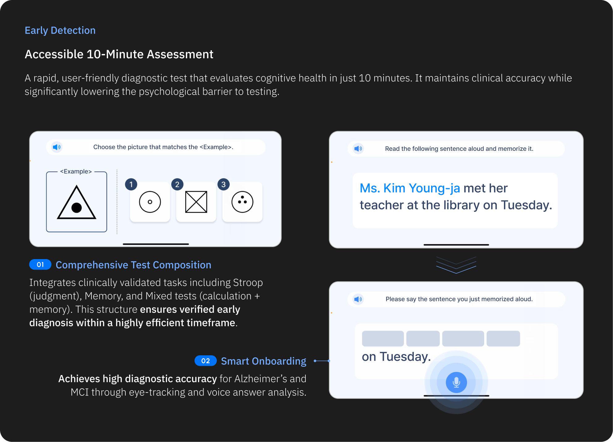
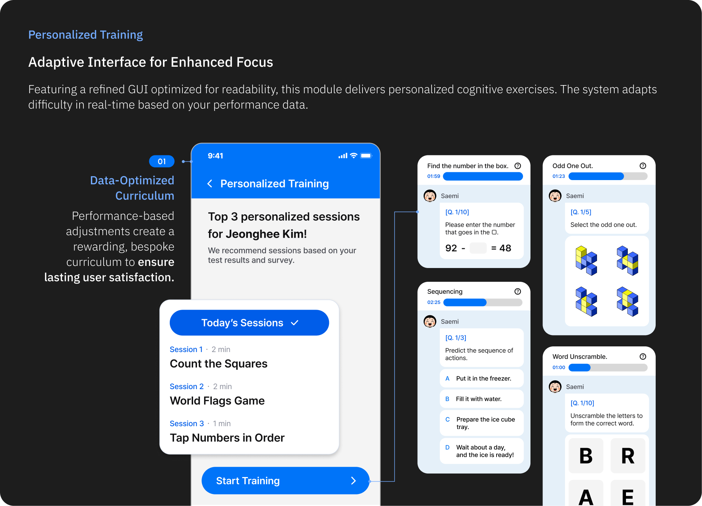
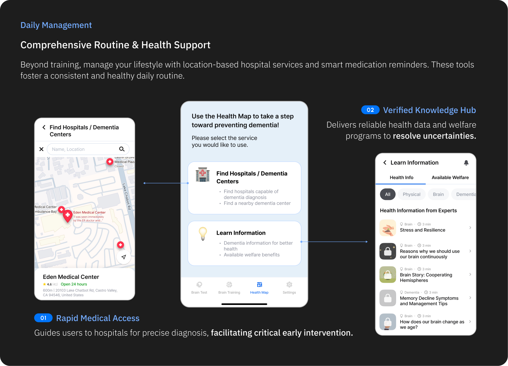

# AlzGuard

Digital Cognitive Health Assessment and Training Platform.

AlzGuard is an interactive digital health system designed to support cognitive health monitoring and training.  
The project explores how interactive systems can help assess cognitive states and provide engaging training experiences.

🔗 **Detailed case study:**  
https://www.eunbicho.me/alzguard

---

## Business Model Canvas

---

## Information Architecture

---

## Prototype UI

